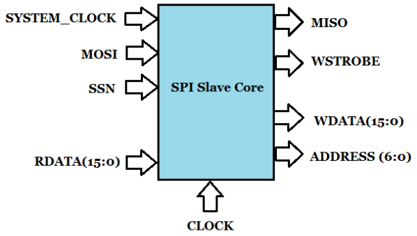
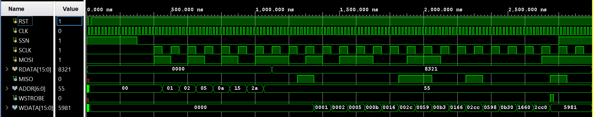

# SPI_Slave
### Design of a slave core of Serial Peripheral Interface (SPI) which is a synchronous serial communication interface specification used for short-distance communication.
-------------------------------------------------------------------------------------------------------------------

#### Tools:  	Vivado 2020.2 |
#### Device: 	Zedboard | 
#### HDL: Verilog |
------------------------------------------------------------

### Block Diagram

-----------------------------------------------------

### Data Configuration

* Frame Size : 24 Bits
* Bits 23-17: 7 bit register address
* Bit 16: Write/Read where 1 indicates the write operation and 0 indicates read operation
* Bits 15-0: 16 bit write data
--------------------------------------------------------------------------------------------------

### Waveform

